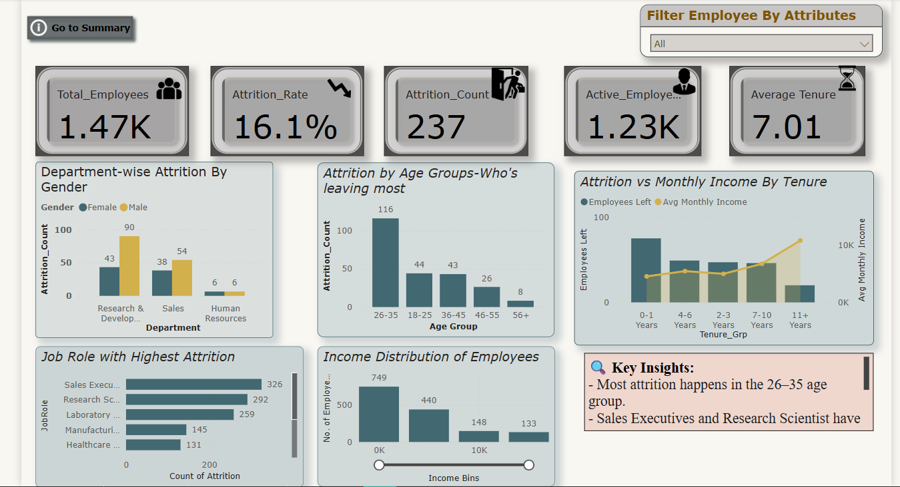
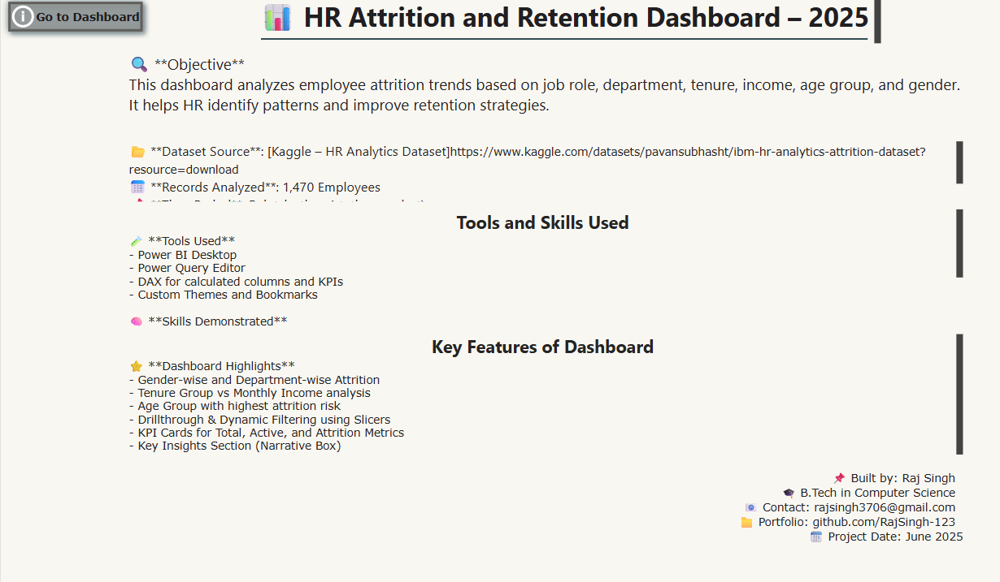

# 📊 HR Attrition and Retention Dashboard – 2025

## 📌 Contents
- [Objective](#objective)
- [Dataset](#dataset)
- [Tools Used](#tools-used)
- [Dashboard Highlights](#dashboard-highlights)
- [Screenshots](#screenshots)
- [About Me](#about-me)


This Power BI dashboard analyzes employee attrition patterns by department, job role, tenure, age group, and gender to help HR identify trends and improve retention strategies.

---

## 🔍 Objective
Understand employee attrition by visualizing HR data to uncover key patterns like:
- Which age group or job role faces the most attrition?
- How does tenure affect employee exits?
- Department and gender-based attrition analysis

---

## 📁 Dataset Source
[Kaggle – IBM HR Analytics Employee Attrition Dataset](https://www.kaggle.com/datasets/pavansubhasht/ibm-hr-analytics-attrition-dataset)

**Total Records Analyzed**: 1,470 Employees

---

## 🛠 Tools & Technologies Used
- Power BI Desktop
- Power Query Editor
- DAX (for calculated columns and KPIs)
- Slicers, Drillthroughs, Bookmarks

---

## 🚀 Dashboard Highlights

- Department-wise and Gender-wise Attrition
- Tenure Group vs Monthly Income analysis
- Age Group with highest attrition rate
- Job Roles with the highest attrition risk
- KPI Cards (Total, Active, Attrition %, Tenure)
- Filter Panel for dynamic attribute selection
- Key Insight Box (Narrative Summary)

---

## 📷 Dashboard Screenshots

### 📌 Main Dashboard View


### 📘 Summary Page


---

## 👨‍💻 Built By
**Raj Singh**  
🎓 B.Tech in Computer Science  
📧 rajsingh3706@gmail.com  
🔗 [GitHub Portfolio](https://github.com/RajSingh-123)  
📅 Project Date: June 2025

---

## 📂 Project Structure
```
HR-Attrition-Dashboard/
├── Images/
│   ├── dashboard.png
│   └── summary.png
├── PowerBI_File/
│   └── HR_Attrition_Dashboard.pbix
└── README.md
```


## 🌐 How to Use
1. Download or clone this repository.
2. Open the `.pbix` file in Power BI Desktop.
3. Replace the dataset if required.
4. Customize visuals or theme as needed.
5. Publish your version to Power BI service or share `.pbix`.

---
## 📄 License
MIT License – feel free to fork and adapt!

⭐ If you found this helpful, feel free to fork or star this repo!
